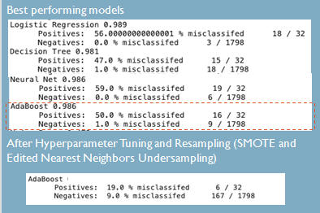

# Amedes Data Challenge

## Project Description
In this data challenge we worked on generating value from the data stored in Amedes' treatment journal. The main goal was to extract valuable information/features from this data and use it to build a machine learning model that can detect a particular disease in a patient. By doing so, we can develop early, accurate diagnoses, which lead to quicker treatment and mitigate the long-term damage caused by the disease. It can also reduce the risks of misdiagnoses.

We focused on four diseases for the purpose of this project namely,
1. M. Gaucher **ICD Code E75.22**
2. Familial hypercholesterolemia **ICD Code E78.0**
3. Familial chylomicronemia syndrome **ICD Code E78.3**
4. β-oxidation defect **ICD Code E71.3**

## Data Sources

Four types of data were provided by Amedes for four sites (Berlin, Hamburg, Frankfurt and Stuttgart):
+ Patient data: Age and sex of the patient
+ Lab results: Lab test results for each patient
+ Anamnestic data: Personally written entry of the treating doctor
+ Diagnostic data: Intermediary and final diagnosis of the patient

## Exploratory Data Analysis

Show/Hide

 
The entire dataset contained 702,258 patients and we have around 100 rows per patient. The gender distribution was unbalanced woth a majority of patients (~75%) being women. The majority of patients were in the age group of 30-90.
 

 

## Preprocessing & Feature Engineering

Show/Hide

 
Preprocessing was done using three python modules that can be found in <a href="https://gitlab.repositories.hec.hfactory.io/antin-2020-challenge/group-3/amedes_challenge/-/tree/master/src/features">src/features</a>

1. <a href='https://gitlab.repositories.hec.hfactory.io/antin-2020-challenge/group-3/amedes_challenge/-/blob/master/src/features/extract_patients.py'>extract_patients.py</a> : Filters the raw data to only the diseases of interest and outputs four files in .csv format, one for each site.
2. <a href='https://gitlab.repositories.hec.hfactory.io/antin-2020-challenge/group-3/amedes_challenge/-/blob/master/src/features/preprocessing.py'>preprocessing.py</a> : Contains helper functions to deal with missing values, calculate age and format date variables
3. <a href='https://gitlab.repositories.hec.hfactory.io/antin-2020-challenge/group-3/amedes_challenge/-/blob/master/src/features/interpret_tests.py'>interpret_tests.py</a> : Functions to clean and structure the lab results.

We built the following features to feed into the machine learning model:

 
We also used clustering algorithms to find word clusters in the anamnestic data. Source code in <a href="https://gitlab.repositories.hec.hfactory.io/antin-2020-challenge/group-3/amedes_challenge/-/blob/master/src/features/clusters.py">src/features/clusters.py<a>

## Modelling and Hyperparameter Tuning

E75.22: M. Gaucher

 

Source code: <a href='https://gitlab.repositories.hec.hfactory.io/antin-2020-challenge/group-3/amedes_challenge/-/blob/master/src/model/modelling_E75_22.py'>src/model/modelling_E75_22.py</a>

Notebook: <a href='https://gitlab.repositories.hec.hfactory.io/antin-2020-challenge/group-3/amedes_challenge/-/blob/master/notebooks/Modeling_Gaucher.ipynb'>notebooks/Modeling_Gaucher.ipynb</a>

The best model to detect M. Gaucher was the Adaboost classifier after sampling the data using SMOTE. It incorrectly classified 19% of all the positive samples (patients with the disease)

E78.0: Familial hypercholesterolemia

 

Source code: <a href='https://gitlab.repositories.hec.hfactory.io/antin-2020-challenge/group-3/amedes_challenge/-/blob/master/src/model/modelling_E78_0.py'>src/model/modelling_E78_0.py</a>

Notebook: <a href='https://gitlab.repositories.hec.hfactory.io/antin-2020-challenge/group-3/amedes_challenge/-/blob/master/notebooks/Modelling%20Hypercholesteramie.ipynb'>notebooks/Modelling Hypercholesteramie.ipynb</a>

XGBoost gave us the best results with a 37% misclassification of positive patients

 

## Future Improvements
+ Build more features from the Anamnestic data
+ Build a more generic model that can detect any disease

## Tools used
+ Python with Numpy, Pandas and Scikit Learn
+ Gitlab
+ Jupyterlab (HEC Data Factory)

## Authors
+ Aicha Bokbot
+ Corentin Sene
+ Leon Leitao
+ Pragya Singh